# Does The RAS Metric System Predict Success In The NFL?

## Introduction

In 2013, Kent Lee Platte created a model to convert a group of metrics into a scoring system for prospective NFL players. This would come to be known as [RAS](https://ras.football/) 
Kent tells the story of how he came up with the system which provides a lot of context [here](https://www.prideofdetroit.com/2016/5/16/11678686/relative-athletic-scores-what-they-are-and-why-they-work).

If nothing else, I hope that you can at least take away from this how a non NFL affiliated individual, driven by his passion for data and football created a model that made NFL scouting a lot easier and whether he knows it or not, changed the landscape for "pre draft" analysts for years to come.

### Glossary

RAS - Relative Athletic Score

PFF - Pro Football Focus

PFR - Pro Football Reference

Cornerback - A position in American Football 

Man / Zone - Defines types of cornerback play types. Man describes when a player follows another player wherever they go. Zone describes a cornerback protecting a specific area of the field.

All-Pro - NFL's 'Team of the Year'

Combine - An event draftees get tested in specific athletic exercises

# Executive Summary

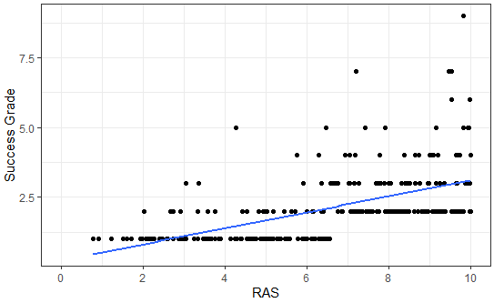

We set out to find out whether a high RAS score indicates a successful career in the NFL. We used both simple and multiple regression, using variables across 10 years from player statistics, body measurements and combine workouts results and created a composite grading scale to use as a dependent variable. We then tested these models against each other to understand the most significant predictors when it came to a successful NFL career  and we found that RAS holds a moderate to strong correlation with NFL success. Based on the other significant variables, theoretically success as an NFL cornerback can be determined by a player who:

- Has a high RAS score
- Has made a lot of interceptions in their career (including high school or college)
- Excels at the broad jump at the NFL combine
- Excels in Zone coverage

Understanding this, may very well help scouts hone in on specific traits that will make a succcessful, hopfully Superbowl winning cornerback.

## Project Background
This objective is not to challenge the RAS model, it is to use the score as a variable to understand the correlation between a score and success and answer the following hypothesis.

*H0* - **RAS doesnt not affect the career success of an NFL Player**

*H1* - **A RAS of *x* will lead to a successful NFL career**

It is to be noted Kent has never stipulated a high score will lead to a successful career. American Football has a lot of variables so isolating them to minimise the impact on the model(s) will be paramount. However, no one has ever asked that question either and furthermore, if there is a way to detect success based on a pre draft process.

### Scope

- We will be using data from 2014-2022 to ensure variety from multiple sources and joining them together. We are excluding 2023 due to this data being rookies and contextually they are at a disadvantage being in their first year in the league due to lack of playing time or "growing pains" adapting to a professional league.
- We will be only looking at the **Cornerback** position, the reason for this is that it is the most independent position in football, a Cornerbacks reliance on other team members to do their job is minimal and is the reason why the position is nicknamed *The Island*, they are alone, detached from all other players on the field.
- Metrics for success will be based around accolades; *all-pro selections* *, *drafted*, *1st round draft pick*, *PFF coverage grade*. * *All recognised all-pro voting [entities](https://en.wikipedia.org/wiki/All-Pro) will count. Height, weight, speed, explosivness metrics that are all captured as part of Combine data.
- The data will be prepared in Excel Power Query and modelled in R, this ensures a clean familiar way to get the data ready and a platform to evidence statistical modelling, testing and visualisations.

## The Data

The data has been sourced from various host sites:

[RAS](https://ras.football/) - Provided the RAS score for all data points

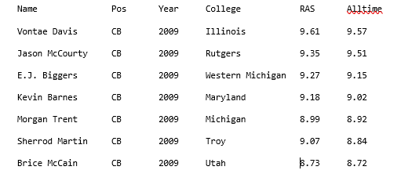

[PFR](https://www.pro-football-reference.com/) - Provided data for all pro selections, draft selection indicator & position & combine results from [Kaggle](https://www.kaggle.com/search?q=nfl+combine+data+in%3Adatasets) (note: although combine results wont be used in the model, they are to reference metrics that could potentially detect successful traits in athletes.)

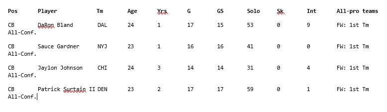

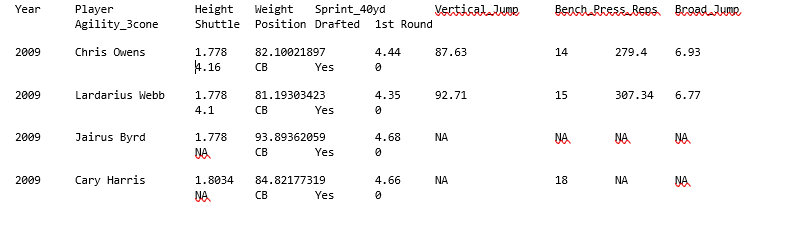

[PFF](https://www.pff.com/nfl/grades/position/cb) - Provided data through its paid service (PFF+) on player grading. This is from a premium service and will adhere with the [licensing agreement](https://www.pff.com/premiumstats#:~:text=All%20subscriptions%20will%20be%20subject%20to%20the%20terms,points%20from%20the%20Licensor%E2%80%99s%20website%20for%20publication%20elsewhere)

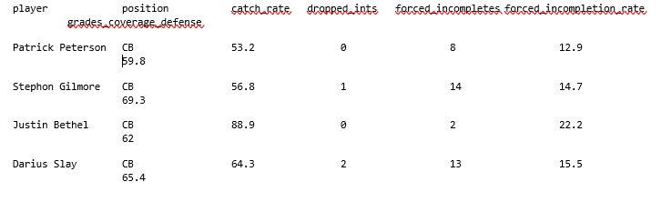

### Preparation

Below is a visualisation of the data 'cleaning' process. Some data needs to be appended as it is stored by year so need to be combined. Data will then be merged in Power Query using the player name after some validation takes place to identify potential duplicates:

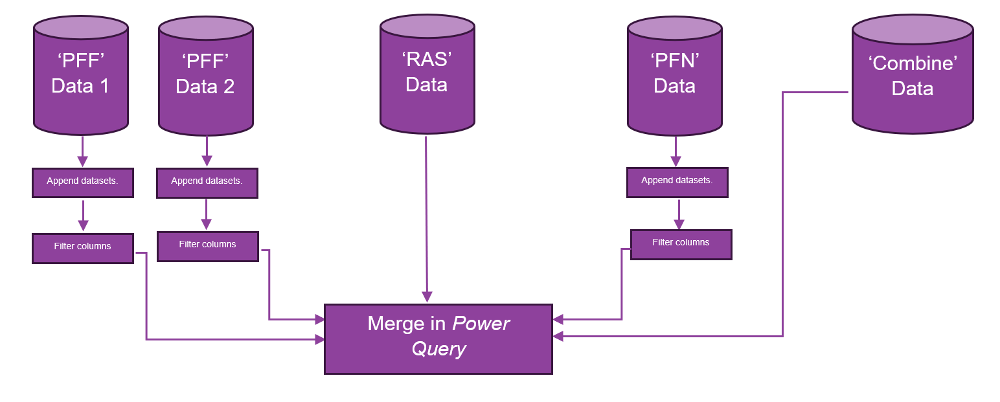

1. As per the process analysis pipeline, the first stage is to complete all appending activities:

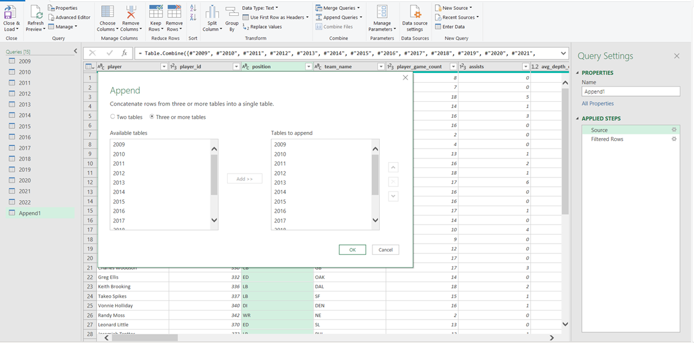

2. Once appended, I had multiple entries for all players. This meant further cleansing however it did let me take my target variables and average or sum them over the whole post-appended dataset.. which is something I was going to have to perform at somepoint!

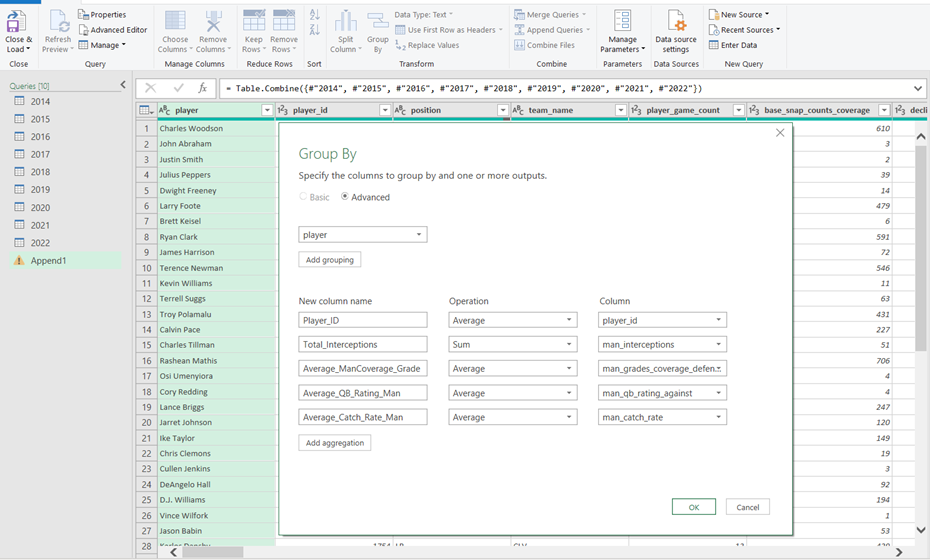

3. Converted all-pro text data to numerical so that it can be quantifiably used in the model.

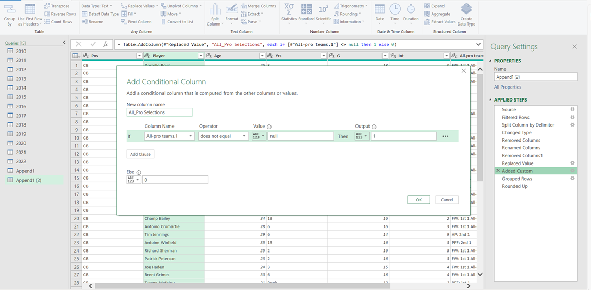

4. At this stage we are going to merge all of the data in Power query together using the name of the player, duplicates have already been addressed where needed. However, some names do not fully match across different datasets due to a number of reasons (initials i.e. AJ/A.J, affixes such as jr, sr, III etc.), to combat this fuzzy matching is performed at a threshold of .75 (after some tinkering).

Decisions around exclusions will be made to ensure the dataset has variety, validity and meets general data ethics standards.
After excluding data that was not relevent to the model the dataset was reduced from 421 to 279 rows. 

5. Clean up data types to ensure compatability with R reader when loading the data in:

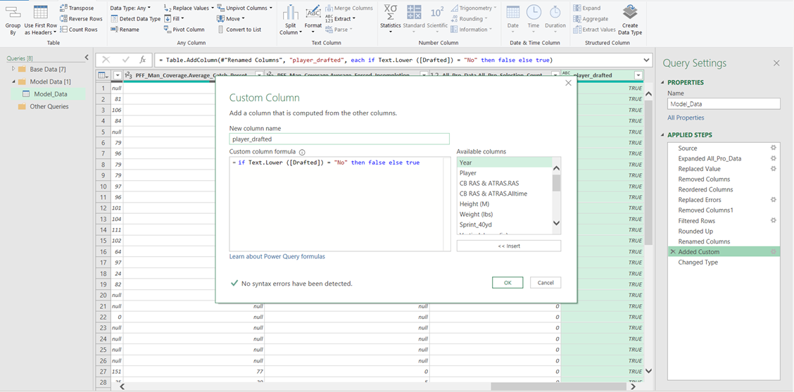

6. Finally change the header format to ensure compatability with R.

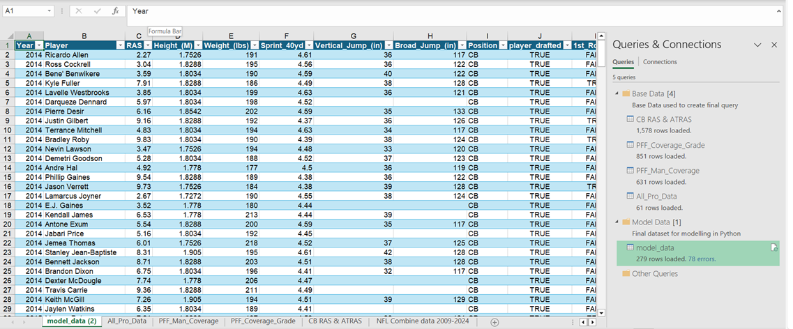

7. The final element is to create a composite grade to use as a dependent variable in our model. We have multiple variables to use but none are consistant enough across the dataset to create a fair model. The proposition is to create a tiering system using our variables.

8. How this will be calculated, where averages are calculated, we will use the dataset itself to find a base value. In the case of [PFF Grading Scale](https://www.pff.com/news/pff-fc-all-you-need-to-know-about-how-grades-are-calculated) we will use > 75 which is between above average and good in terms of an average career score.:

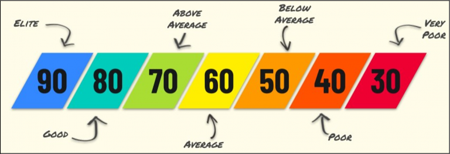
- RAS > 6.59 = 1, else 0
- player_drafted IS TRUE = 1, else 0
- 1st_Round IS TRUE =1, else 0
- Total_Interception_value < 4 = 1, else 0
- Superbowl_wins > 0 = 1, else 0
- All_Pro_Selection_Count > 0 = 1, > 1 = 2, > 2 = 3, else 0 (example below)
- Average_Coverage_Grade_Man > 75 = 1, else 0
- Zone_Grade > 75 = 1, else 0

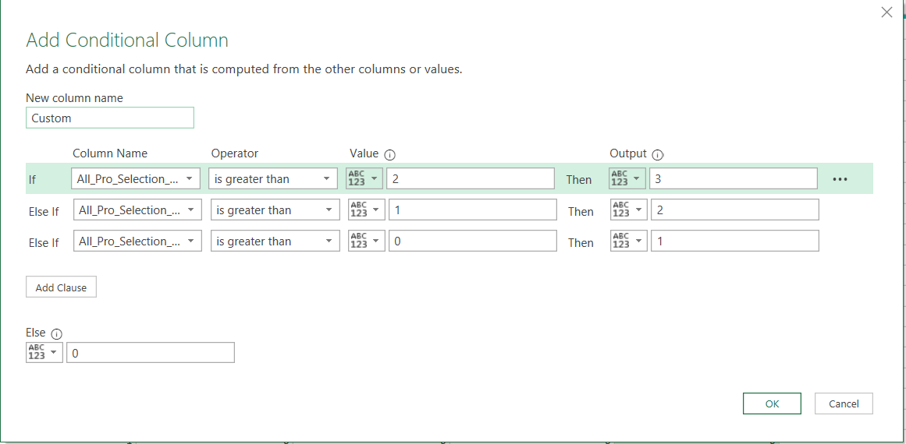

Finally, the fields are added together to get a final score to use as a dependent variable and then all unneeded columns removed.
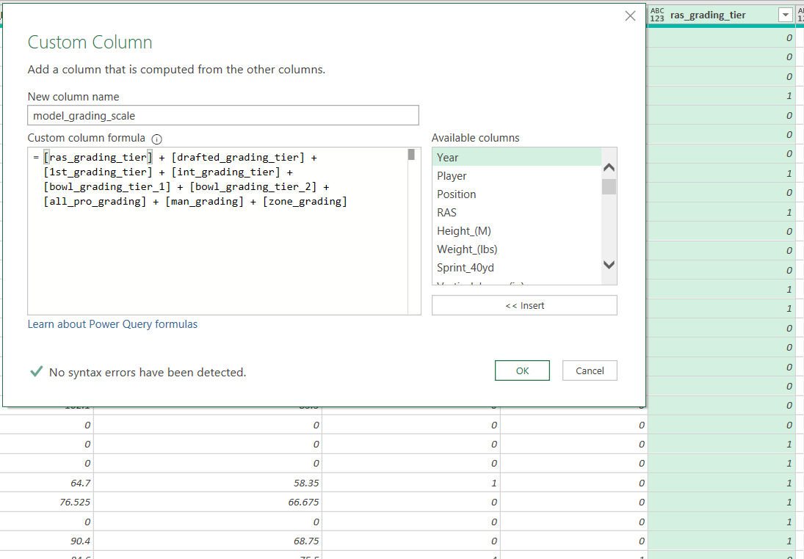

## Modelling

2 models will be built:

- Simple Regression - Analysing the relationship between RAS (independent variable) and composite grade (dependent variable)
- Multiple Regression - Comparing composite grade (dependent variables) with multiple indepdendent variables that suit the model based on correlating them against eachother

It is to be noted and accepted that the dependent variable is not normally distributed, this will not change our approach and following the Gauss-Markov Theorem, will need to consider residuals even moreso than normal when evaluating our model.

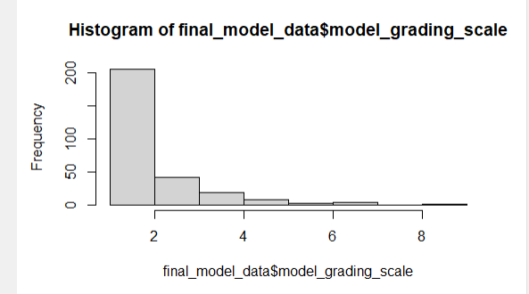

### Simple Regression

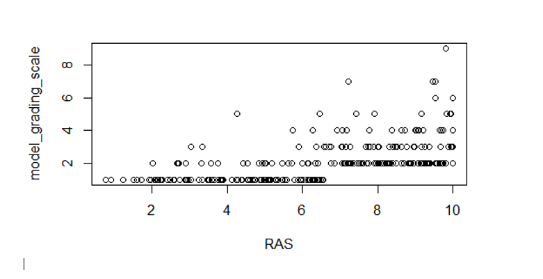 

At a glance, there is no stong correlation between RAS and the composite grade, showing a concentration of points at the end of both axis.
### Evaluation

Multiple R-squared (0.31135) - This tells us that 31% of the composite grade can be explained by RAS. The adjusted R-squared (0.311) is slightly lower, meaning that when the model is accounting for the number of predictors, its significance is slightly reduced.

p-value (<2.2e-16) - the value shows that the model is statistically significant, and that RAS significantly predicts the composite grade, a F-Statistic (126.5) shows a substantial significance. However, it would need to be compared to models of similar context with varying degrees of freedom to truly be evaluated.

Based on the above, **we cannot reject *H1* as there is evidence of RAS being a reliable predictor**. However, testing against other variables may give us more of a full picture.

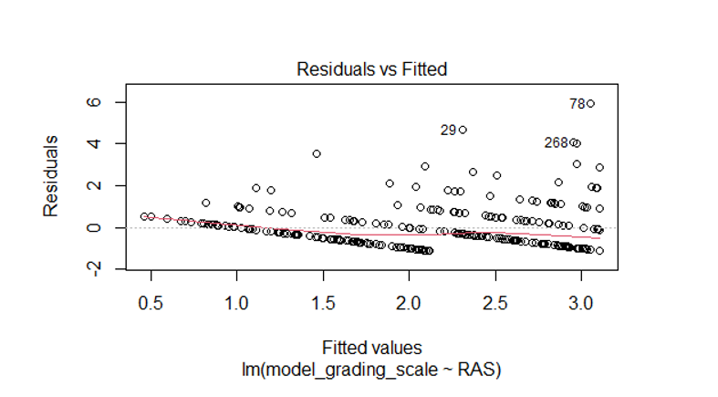
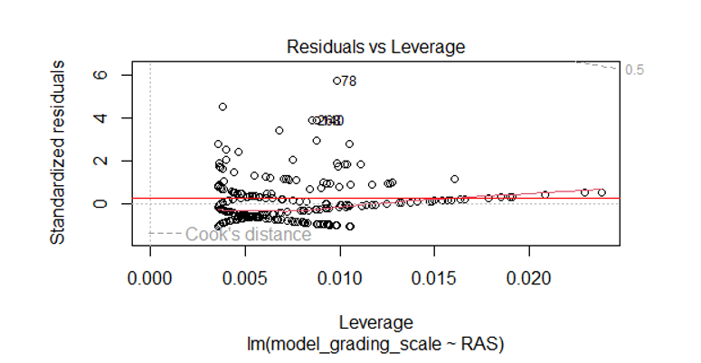
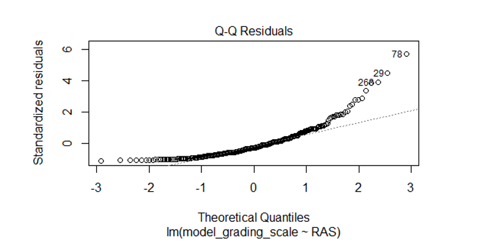
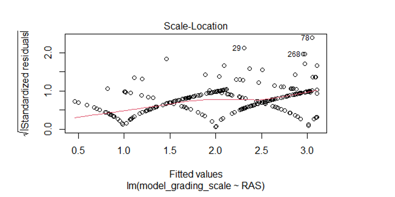

The residual standard error (1.041) is reasobaly close to normality, however the deviations evidence a clear non-linear distribution. Although there doesnt seem to anything too critical in the results, the Scale Location shows potential of heteroscedasticity (varying variance) which will be accounted for by checking for multicollinearity (high correlation) between the independent variables prior to performing multiple regression testing. Additionally we will evaluate the results of a heteroscedasticity consistent
covariance matrix (HCCM) to further determine reliability.

`model_hccm <- hccm(model_lm, type = "hc3")`

`print(model_hccm)`
          
            `(Intercept)           RAS`

`(Intercept)  0.020852754 -0.0033875882`

`RAS         -0.003387588  0.0006380138`

**Coefficient estimates**

`intercept_estimate <- 0.24246`

`RAS_estimate <- 0.28627 `

**Robust standard errors**

`robust_se_intercept <- sqrt(0.020852754)`

`robust_se_RAS <- sqrt(0.0006380138)`

**Calculate t-values**

`t_value_intercept <- intercept_estimate / robust_se_intercept`

`t_value_RAS <- RAS_estimate / robust_se_RAS`

**Print t-values**

`t_value_intercept [1] 1.67903`

`t_value_RAS [1] 11.33342`

The robust standard errors provided by the HC3 method gives us reliable estimates even in the presence of heteroscediscity and the t values determine RAS as a reliable variable in the model. The composite grade significance is low, however that can be contextually justified due to its manual creation.

### Multiple Regression 

As mentioned before due to the non linearity of the data, it is advisable we test for multicollinearity by understanding the correlation between the independent variables, to do this we creating a correlation matrix to observe the correlation coefficiant and visualised it in a heatmap.

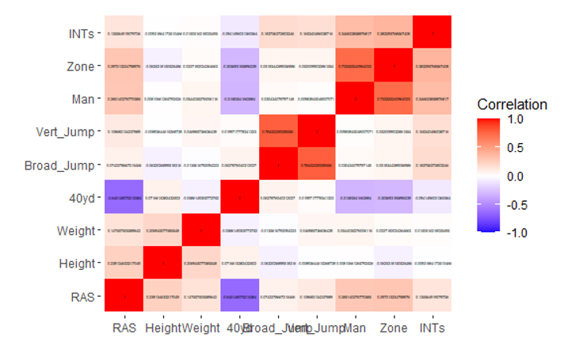

As seen on the heatmap, the closest areas to 1 are seen between coverage types 'Man' and 'Zone', which is expected.. they are the same exercise performed in a different way. For now, we will keep both in but repeat the regression model a 2nd time, removing Zone as contextully is is the more dependent on "on field variables" out of the two. We will then compare the models to decide which is best.

3 models were performed; the original indepdent variables were split into 2 as doing them together created a scenario where some variables were used as a subset to filter the dataset, this was likely due to multicollinearity concerns as 'Man' and 'Zone' were 2 of thise variables. The other two being 'Vert_Jump' and 'INTs'. Below we can see the perameters and statistics of each model, each one more refined and theoretically a better fit than the last based on statistical significance:

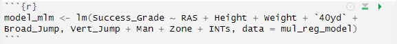
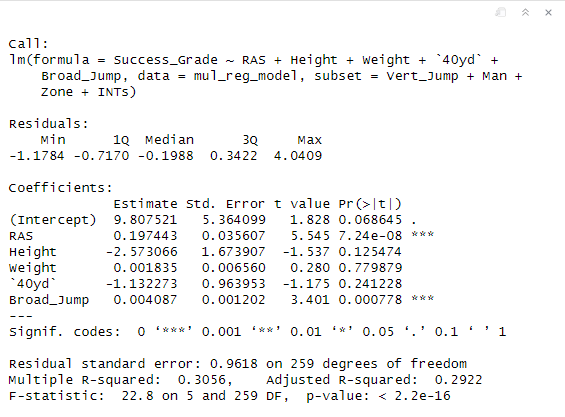
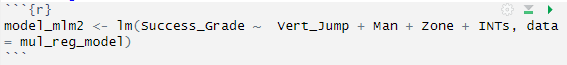
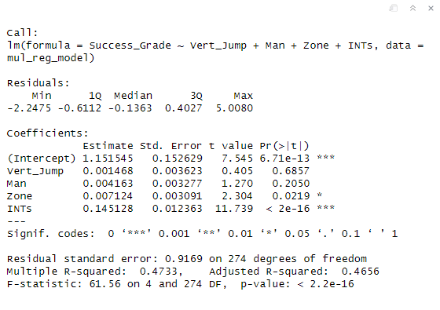
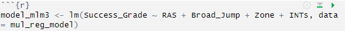
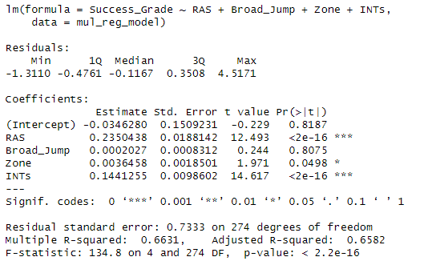

As observed when the model significance is compared against one another, we can see that model 3 is far more sigficicant in terms of using variables to predict success, of which RAS is one! To validate the models we evaluated the fit by using AIC & BIC (the latter to account for the difference in independent variables across the models.) and thus evaluating for model selection.

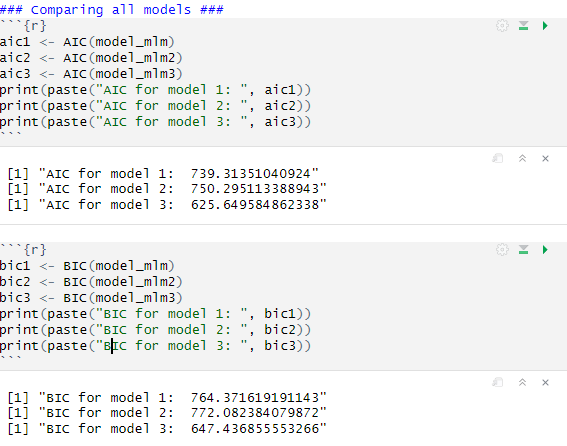

As observed, model 3 is the most appropriate fit. Additionally, we can deduce from the statistics that RAS along with Interceptions are the strongest predictors and as such **we cannot reject the alternate hypothesis**.

# Recommendations

The next step in this work will be to evaluate players drafted since 2023 and predictive analysis based on the results we have attained to assess which players will have successful careers. This workstream will be publicised and invite peers to review to improve future iterations.

Work will be done in the near future to frame the players who meet the threshold of success based on the model and their progress tracked on a yearly basis to create extra valaidity for the methods used.

It is important to remember there are always statistical outliers and contextual exceptions to this; Ahmad "Sauce" Gardner (pictured below), drafted in 2022 was excluded from this model as he did not have a qualifying RAS score. However, he was drafted in the 1st round and has 2 All Pro selections already in his career, but only 2 interceptions across those two years and thats because he is so good, opposing Quarterbacks will not throw his way. There are many nuances to the game of American Football and its what keeps it fresh, fun and keep analysts guessing.

# References

Howland, F. and Barreto, H. eds., (2005). The Gauss–Markov Theorem. [online] Cambridge University Press. Available at: https://www.cambridge.org/core/books/abs/introductory-econometrics/gaussmarkov-theorem/704ECAC688A098805F6647E9D7B1F0AE [Accessed 5 Jul. 2024]. *The Gauss–Markov theorem also works in reverse: when the data generating process does not follow the classical econometric model, ordinary least squares is typically no longer the preferred estimator.*

Long, J.S. and Ervin, L.H. (2000). Using Heteroscedasticity Consistent Standard Errors in the Linear Regression Model. The American Statistician, 54(3), pp.217–224. doi:https://doi.org/10.2307/2685594. [Accessed 5 Jul. 2024] *If the sample is less than 250, the form of HCCM known as HC3 should be used; when samples are 500 or larger, other versions of the HCCM can be used. The superiority of HC3 over HC2 lies in its better properties in the most extreme cases of heteroscedasticity.*

‌‌NFL.com. (n.d.). The high-wire life of an NFL cornerback. [online] Available at: https://www.nfl.com/news/the-high-wire-life-of-an-nfl-cornerback[Accessed 28 Jun. 2024]. *It's why the position is nicknamed The Island. Detached from 20 other players on the field, the cornerback knows millions of eyes will fall on him when quarterbacks launch the deep ball -- and in the case of touchdowns, many of those looks will turn to an angry glare.*

Parzen, E., Tanabe, K. and Kitagawa, G. (1997). Selected Papers of Hirotugu Akaike. New York, NY: Springer New York. pp 275–280 https://doi.org/10.1007/978-1-4612-1694-0_21 *Akaike introduced an information criterion which is by definition (1.1) AIC=( -2) log (maximum likelihood) +2(number of parameters)  as an estimate of minus twice the expected log likelihood of the model  whose parameters are determined by the method of maximum likelihood. Here log denotes the natural logarithm.*

PFF. (n.d.). PFF Player Grades. [online] Available at: https://www.pff.com/grades.[Accessed 28th Jun. 2024].

‌RAS. (2017). RASAbout Me. [online] Available at: https://ras.football/about/ [Accessed 28 Jun. 2024].

RAS. (n.d.). RASRelative Athletic Scores grade a player’s measurements on a 0 to 10 scale compared to their peer group. [online] Available at: https://ras.football/[Accessed 28 Jun. 2024].

Sadanori Konishi and G Kitagawa (2008). Information criteria and statistical modeling. New York: Springer. (Volume 16, Issue 1, May 1981, Pages 3-14) *The basic idea underlying the use of an information criterion, called AIC, for model selection is the maximization of the expected log likelihood of a model determined by the method of maximum likelihood [Akaike (1973, 1974)].*

Tranmer, M., Murphy, J., Elliot, M. and Pampaka, M. (2020). Multiple Linear Regression (2 nd Edition). [online] Available at: https://hummedia.manchester.ac.uk/institutes/cmist/archive-publications/working-papers/2020/multiple-linear-regression.pdf. [Accessed 5 Jul. 2024] *What is meant by a “high level of correlation” is somewhat subjective, here we apply a rule of thumb that any correlation over |0.7| is considered high. Where a pair of variables are highly correlated, it may be worth considering removing one of them from the analysis.*

‌‌
